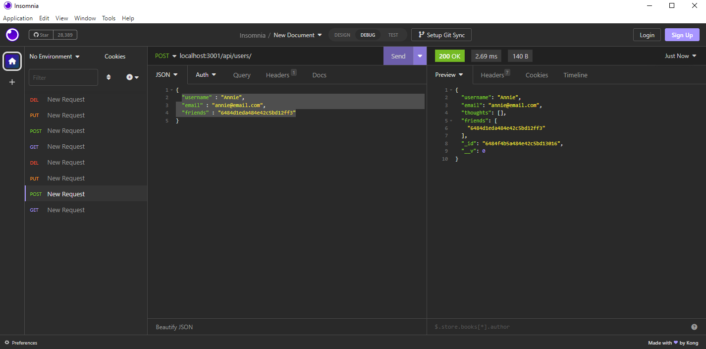
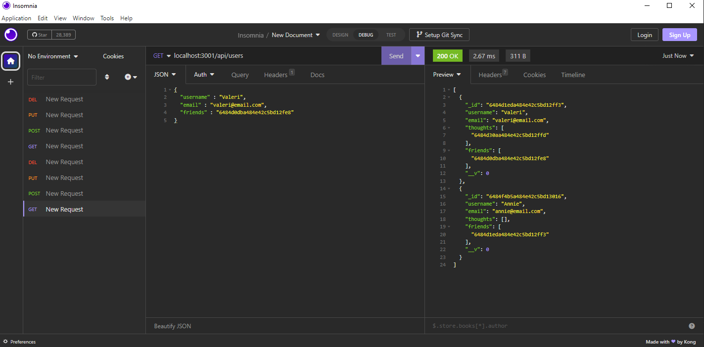
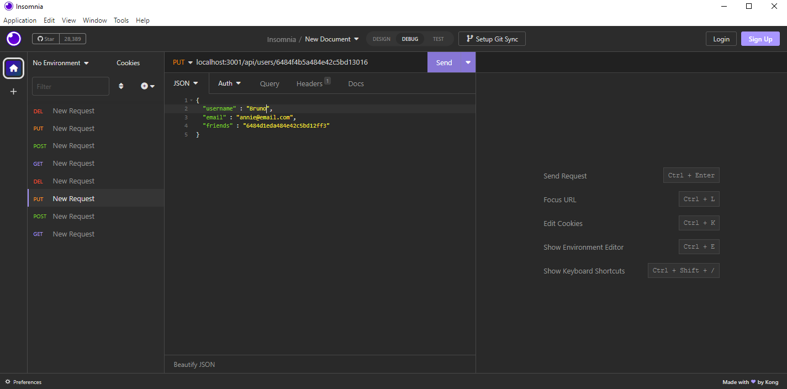
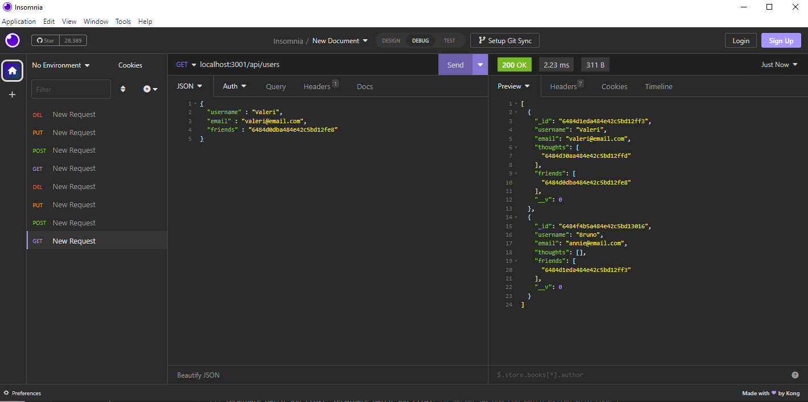
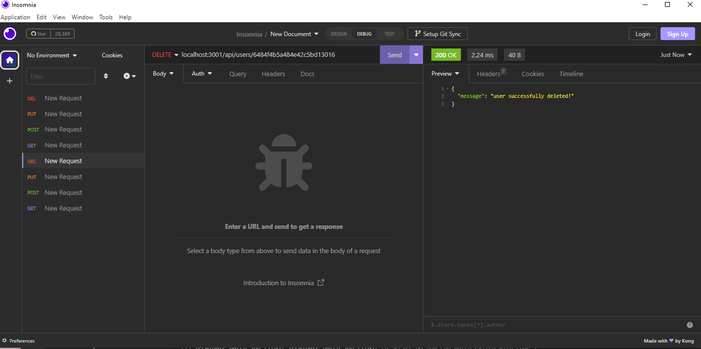
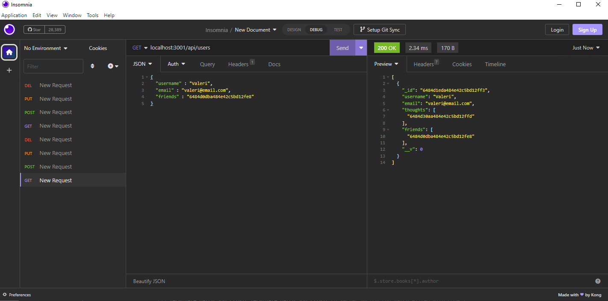

# SharedThought

## Description
This is a backend for an application that shared thought, and you can see who your friends are.

## Usage
To use this application, you will need to run npm install to install the depedencies that you need. Once that is done, you can run npm run start in the console, and the server will start. You can then open insomnia to use the api routes. 
Example 1: If you want to see the users, you got to localhost:3001/api/users. 
Example 2: If you want to see the thought instead, you go to localhost:3001/api/thoughts.

## Screenshot

## Credit
My GitHub profil is [Valerigionetnoel](https://github.com/Valerigionetnoel) you can email me [here](mailto:valeri.gionetnoel@gmail.com)

## License

Refer to license in repo for more information.